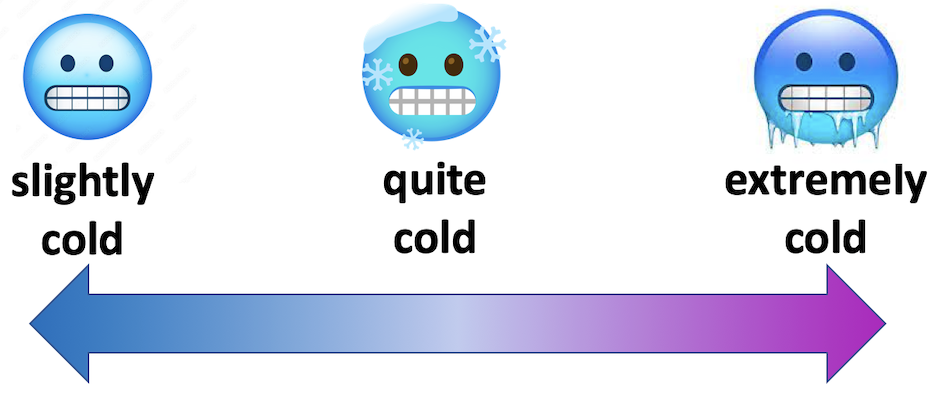

# Not wacky vs. definitely wacky: A study of scalar adverbs in pretrained language models.

This repository contains the code and data which was used for the analyses on how language models handle scalar adverbs presented in the following paper https://arxiv.org/abs/2305.16426, presented at BlackBoxNLP workshop at EMNLP 2023. 

The pdf of the poster presented at the conference has been added to the repo. 



<!-- &nbsp;&nbsp;&nbsp;&nbsp;&nbsp;&nbsp;&nbsp;&nbsp;&nbsp;&nbsp;&nbsp;&nbsp;&nbsp;&nbsp;&nbsp;&nbsp;&nbsp;&nbsp;&nbsp;&nbsp; -->


# Citation
If you use the code or data in this repo please cite the following paper:
```
@inproceedings{lorge2023wacky,
title = {Not wacky vs. definitely wacky: A study of scalar adverbs in pretrained language models}, 
author = {Lorge, Isabelle and Pierrehumbert, Janet}, 
booktitle = {Proceedings of the 2023 Conference on Empirical Methods in Natural Language Processing },
series = {Workshop on analyzing and interpreting neural networks for NLP (BlackBoxNLP)}, year = {2023}
}
```
