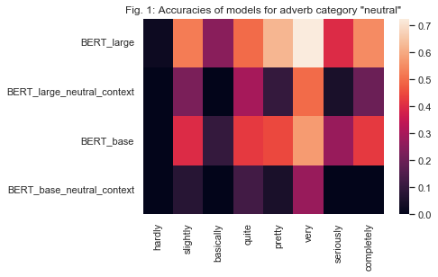
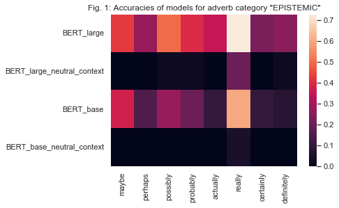
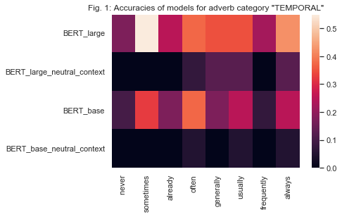
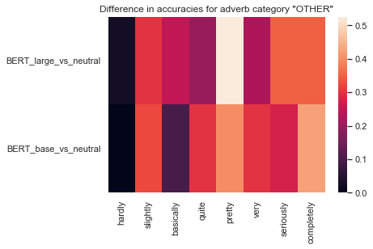
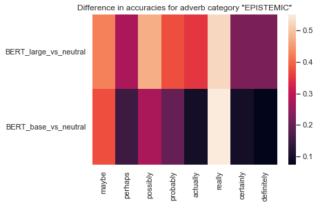
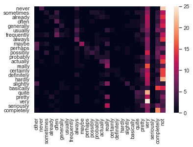
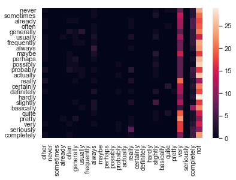
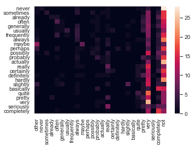
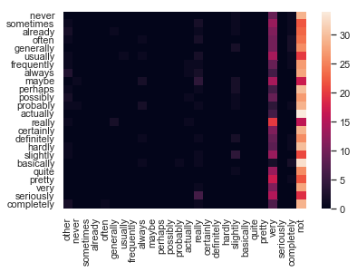

# Testing language models' ability to predict intensifiers

non-predictable : In the last six the "benefits" of the program start to kick in.   This is very common.

predictable: 

We chose the most frequent adverbs (from reddit frequencies) in our chosen semantic categories, only excluding ambiguous ones which get parsed wrong often (so, just, etc). According to the classification of adverbs and adjectives proposed by Paradis (1997), some are 'maximizers' (e.g., 'completely') which target extreme (eg, 'freezing') or limit (eg, 'dead') adjectives and some are 'scalar' adverbs which combine with scalar (eg, 'cold') adjectives. 

The reason we chose this synthetic structure is so it would work with all non-negative intensifiers regardless of their intensity (eg, 'It is not legal. In fact, it is sometimes illegal.'  vs 'I do not think it is legal. In fact, it is sometimes illegal'). 

Our work aligns itself with the tradition of performing psycholinguistically-inspired tests on language models

synthetic_neutral (BERT large): top 1 'not': 0.66, top 10: 0.8, % original adverb above = 0.08
synthetic_context (BERT large): top 1 'not' = 0.48, top 10 'not' : 0.8, % original adverb above = 0.07
synthetic_neutral (BERT base) : top 1: 0.50, top 10: 0.94, ori: 0.03
synthetic_context(BERT base): top 1: 0.70, top 10: 0.96, ori: 0.03

We need LMs to produce representations which allow entailment inferences, yet trained distributionally they can't. 

Conclusion: consistent with findings about antonyms (Talmor et al., 2019), LMs seem unable to reliably distinguish negation from intensifiers (which have opposite meaning) and negation remains most of the time in the top predictions among intensifiers, (though LMs do get a boost from context). We can see from selected examples that there are cases where negation is ranked above target intensifier when context would lead a human to choose `any` intensifier rather than a negation.  Furthermore, there is little indication of LMs having captured the intensity of adverbs (they are not more likely to be predicted above not the more intense they are). Finally there is no indication that LMs representations of adverbs which share semantic characteristics (such as temporal or epistemic meaning) are closer together. Regarding intensifier adverbs, thus, most predictions seem to be driven by frequency effects. 

## Next steps
fine-tuning, building different types of phrase representations

## Limitations
1. We do not have a gold standard/upper bound for performance
2. LM fail to place target above not but often predictions above not are sensical
3. Small test dataset. The point is to investigate further and test different models to see if we can do better, by fine tuning but also using different architectures. 
4. The confusion matrix is based on a noisy measure, ie the top prediction in our target list. 

## Rationale 
Large language models trained to produce representations based purely on a distributional assumption (i.e., that words with similar contexts have similar meanings) tend to struggle with producing meaningful representations of words which have a high contextual overlap (e.g., antonyms or negation). We want to test the ability of these models to predict the presence of an intensifier in an original sentence (versus a negation). 

We wish to investigate:
1.  Is the language model is able to overcome frequency effects by using context to predict the correct adverb
2.  Does the prediction accuracy correlate with the intensity of the original adverb (i.e., adverbs with higher intensity whose semantics are further from negation are more accurately predicted)

3.  Does the accuracy differ depending on the type of intensifier, i.e., intensifiers with neutral semantics versus those which integrate a temporal or epistemic dimension. If so which ones are easier or harder?

## Method
### Data
We select 24 intensifier adverbs among the most frequent in the dataset: 8 intensifiers including a temporal dimension (never, sometimes, already, often, generally, usually, frequently, always) 8 intensifiers including an epistemic dimension (maybe, perhaps, possibly, probably, actually, really, certainly, definitely) and 8 neutral intensifiers (hardly, slightly, basically, quite, pretty, very, seriously, completely) spanning a range of intensities along their respective dimensions. 

We use data from the Reddit politosphere (Hofmann et al., 2021) dataset. We collect all data from 2015 (about 6GB uncompressed) and use Spacy dependencies to filter for phrases with syntactic form 'ADV+ADJ.' Filtering for sentences which end with the target expression allows us to control its position for human comparison (controlling context seen when they get to the mask) and potentially use autoregressive left-to-right language models for prediction. 

We collect all adjective types and tokens for each adverb. The diversity ranges from 40 different adjective combinations (for 'frequently') to over 3k for the most frequent adverbs ('very' and 'really'). We examine the bigram frequencies using the Google Ngram API and find them to be fairly normally distributed when transformed into base e logarithms, mostly ranging between -22 and -10 with a mean and median around -16. 

Taking our least frequent adverb as an upper bound, we select 40 different adjective combinations for each adverb, extracting a context of 1-2 sentences between 10 and 40 words each time. For each adverb, we take the most frequent and least frequent combinations (excluding spelling errors) and then select 38 combinations at random from the relevant sample. 

Examples
| Sentences | Negative | Target| 
| :---: | :---: | ---- |
|  They don't want to be armed.  The ones that would want guns are `probably scary`.| They don't want to be armed.  The ones that would want guns are `not scary`.| probably scary |
|  Regardless of what you may think of him, this is `really touching`. |  Regardless of what you may think of him, this is `not touching`.|really touching|

### Task
We choose a fairly conservative task which could easily be set up for human evaluation for comparison purposes. For each example, we ask whether the model would predict the original intensifier rather than a negation (which would in most cases have the opposite meaning). To evaluate this, we check whether the original adverb ranks above the negation in the predictions for this position. This is because many things in the context can influence the ranking of an adverb but we want to focus on whether the language model is able to predict that a rank zero on the scale, or the opposite of an intensifier should be very unlikely in many of these sentences. Another reason for using this task is that it can easily be transformed into a classification task for humans (whereas it would be impossible to obtain rankings of words across all vocabulary from humans). 

For this comparison to be possible, the position of the negation should be the same as that of the original adverb. Thus, we modify the structure of the few sentences where a negation would not have seemed naturalistic, e.g., 'I'm glad he didn't take the job. He would have been frequently exhausted' => 'I'm annoyed he took the job. He is frequently exhausted'. This generally produces sentences where a negation could naturalistically be inserted, e.g., 'I'm annoyed he took the job. He is not exhausted.'

We replace the target position with the [MASK] token and obtain from the BERT large and BERT base cased models the prediction probabilities and ranks for the original adverb, negation ('not') and the top 10 predictions for error analysis. We also obtain the same for a truncated 'neutral' context as baseline on prior probabilities, e.g., 'is frequently exhausted' (we do not add pronouns such as 'It', 'She' or 'He' as each of these is shown to exert bias on predictions, but adding the verb 'is' prompts BERT to recognise the syntactic structure and suggest appropriate completions).

## Results 

### `BERT large`
We calculate the accuracy (number of times the original adverb is ranked above negation), MRR (mean reciprocal rank of original adverb) and 'diff' (the average difference between rank of adverb and rank of negation; a positive difference means on average negation has lower rank, comes above in the ranking)

- average accuracy:  0.39 (+0.3 with context)
- MRR:  0.17(+ 0.07 with context)
- average diff:  17 (-143 with context)

Per adverb:

`NEUTRAL`

The neutral category was the one with the highest prior frequency/
accuracy without context (0.17), epistemic was 0.03 and temporal was 0.05. Th epistemic category gets the biggest context boost. 

average accuracy: 0.45 (+ 0.28 with context)
MRR: 0.22 (+ 0.05 with context)
diff: 9.29 (- 69 with context)

- `completely`: 
{'acc': 0.525, 'MRR': 0.09381856332307728, 'diff': -9.5}

- `seriously`:
{'acc': 0.4, 'MRR': 0.09616571616212585, 'diff': 53.825}

- `very`: 
{'acc': 0.725, 'MRR': 0.5503681016980435, 'diff': -22.425}

- `pretty`: 
{'acc': 0.625, 'MRR': 0.19027027367998, 'diff': -16.8}

-  `quite`: 
{'acc': 0.5, 'MRR': 0.2594916616158157, 'diff': 14.375}

-  `basically`: 
{'acc': 0.55, 'MRR': 0.3949152405912109, 'diff': -4.7}

- `slightly`: 
{'acc': 0.25, 'MRR': 0.07400610369280741, 'diff': 15.175}

- `hardly`: 
{'acc': 0.025, 'MRR': 0.0840489540439977, 'diff': 44.375}

`EPISTEMIC`

acc: 0.39 (+ 0.36 with context)
MRR: 0.14 (+ 0.11 with context)
diff: 27.44 (- 297 with context)

- `definitely`: {'acc': 0.25, 'MRR': 0.08789945887132253, 'diff': 55.05}

- `certainly`: {'acc': 0.225, 'MRR': 0.11673036764580177, 'diff': 18.675}

- `really`: {'acc': 0.725, 'MRR': 0.24820748440023116, 'diff': -21.85}

- `actually`: {'acc': 0.35, 'MRR': 0.18352471606611626, 'diff': 5.9}

- `probably`: {'acc': 0.4, 'MRR': 0.10214808630050005, 'diff': 2.175}

- `possibly`, {'acc': 0.5, 'MRR': 0.12651156825159232, 'diff': 32.7})

- `perhaps`: {'acc': 0.275, 'MRR': 0.06421658869360565, 'diff': 42.0}

- `maybe`: {'acc': 0.425, 'MRR': 0.16357214371018916, 'diff': 84.9}

`TEMPORAL`

acc: 0.34 (+ 0.29 with context)
MRR: 0.15 (+ 0.1 with context)
diff: 15.50 (-78 with context)

- `always`: {'acc': 0.425, 'MRR': 0.2478908550977482, 'diff': 8.7}

- `frequently`: {'acc': 0.225, 'MRR': 0.02832851722070597, 'diff': 96.3}
- `generally`: {'acc': 0.35, 'MRR': 0.10861424506381287, 'diff': -0.375}
- `usually`: {'acc': 0.35, 'MRR': 0.11513225070964965, 'diff': 4.85}
- `often`: {'acc': 0.375, 'MRR': 0.22101984882358305, 'diff': -2.475}
- `already`: {'acc': 0.25, 'MRR': 0.09974669209479751, 'diff': 20.175}
- `sometimes`: {'acc': 0.55, 'MRR': 0.18005722093943818, 'diff': -12.925}
- `never`: {'acc': 0.175, 'MRR': 0.24307157872714832, 'diff': 9.775}

### `BERT base`
average accuracy:  0.26 (+ 0.23 with context)
average MRR:  0.15 (+ 0.07 with context)
average diff:  35 (- 110 with context)

`NEUTRAL`
- acc: 0.33 (with context: + 0.27)
- MRR: 0.22 (with context: + 0.08)
- diff: 22 (with context: - 93)

`EPISTEMIC`
- acc: 0.25 (with context: + 0.24)
- MRR: 0.11 (with context: + 0.09)
- diff: 42 (with context: - 173)

`TEMPORAL`
- acc: 0.22 (with context: + 0.2)
- MRR: 0.11 (with context: + 0.06)
- diff: 30 (with context: - 57)

### Discussion

The accuracy of BERT large is on average 0.39, which means it generally fails to rank the original adverb above negation. BERT base performs even worse with an average accuracy of 0.26. The only adverbs for which the accuracy is above average are the common 'very', 'pretty' and 'really' which benefit from high prior frequencies. 

However, it does benefit from context, as the accuracy improves by 0.3 on average when context is added. The epistemic category gets the highest boost in BERT large with an improvement of 0.36  with context, whereas the neutral category gets the highest boost of 0.27 in BERT base. BERT large gets a higher boost from context than BERT base. 

While the correlation with intensity scale is not perfect, there is some indication of it, with the model having the most difficulty distinguishing 'hardly' and 'never' from 'not', as expected, and intense adverbs such as 'very', 'always', 'really' and 'completely' generally having high accuracies. 

In the heatmaps, you can see the boost in accuracy which each adverb gets from context, with adverbs such as 'very' and 'really' having high accuracies in the neutral context due to their higher frequencies. If the language models correctly represented the meaning of the intensifiers, the boost in accuracy should be correlated with the distance between intensifier meaning and negation, with more intense adverbs benefitting from a stronger boost in accuracy. As we can see in the below plotted differences in accuracy, this is not the case for either BERT large or BERT base. 

